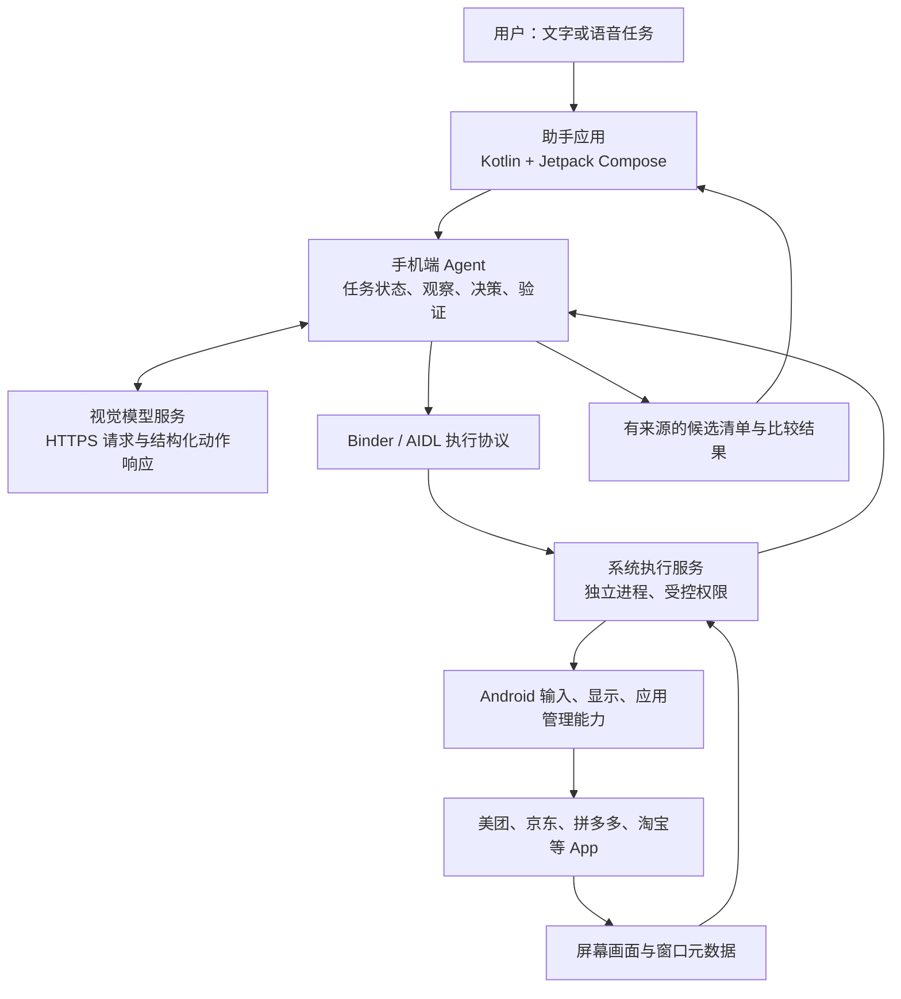

# 技术架构

状态：设计草案。描述本项目拟实现的架构，不声称复现豆包未公开的内部实现。

后台执行的完整能力范围和主屏保护要求见[能力清单与隔离约束](capabilities-and-isolation.md)。正式基础 ROM 冻结后，日常迭代仅更新 APK；独立显示不等于键盘、音频和硬件资源已经隔离，必须通过专项实测后才能冻结底层。

## 运行结构

只有模型推理依赖远程服务。任务循环运行在手机上，手机无需持续连接电脑。MVP 不额外搭建业务后端、账号系统或 Python 编排服务器。

## 模块及技术选择

| 模块 | 技术方向 | 职责 |
| --- | --- | --- |
| 助手应用 | Kotlin、Jetpack Compose | 任务输入、运行状态、停止/接管、结果展示；先文字，后语音 |
| Agent | Kotlin、Coroutines；与助手同一 APK | 执行单步任务循环、模型响应校验、超时和中断、整理候选结果 |
| 执行协议 | Binder/AIDL，显式绑定 | 在助手进程与具有系统权限的执行进程之间通信 |
| 系统执行服务 | 在 ROM 源码树中构建的独立系统 APK/进程，新增逻辑使用 Kotlin | 截图、动作执行、焦点校验、动作串行化、运行状态与取消 |
| ROM 集成 | LineageOS 设备适配、Soong、权限 XML、按需 SELinux 规则 | 内置执行组件、配置系统签名和权限、设备构建与固件匹配 |
| 模型连接 | HTTPS；多套模型连接配置，可选择当前配置 | 发送任务和必要屏幕上下文，解析模型动作；按协议实现适配器，服务地址、模型名称和 API Key 不写死 |

### 模型配置与切换

用户需要实验不同 AI，模型配置属于产品功能，不依赖修改代码或重新打包。助手提供配置入口，可新增、编辑、删除多个连接配置，并选择新任务使用的配置。每套配置包含显示名称、API 协议类型、Base URL、模型名称和 API Key；同一协议下允许使用自定义服务地址和模型名称。

不同供应商不一定兼容同一种 API，协议适配与连接参数分开。先完成一种实际选定协议，再按实验需要增加适配器；不能宣称填写任意 Key 就能调用任意模型。连接测试由用户主动触发，分别展示鉴权/接口连通、图像输入、动作格式支持情况，不把一次普通文本响应视为 GUI Agent 可用性验证。

密钥保存在设备本地受保护存储中，不嵌入 APK 或 ROM、不进入 Git、日志或默认配置导出。设置页默认遮蔽密钥。测试使用固定样例，不自动上传当前手机画面。运行中的任务固定使用启动时的配置快照，切换配置对新任务生效，避免执行中途混用供应商。

手机设置入口纳入助手设计；用户提及的“桌面配置”是否还包含 Mac 配置界面待确认，不先引入同步服务或额外业务后端。

执行模块通过小接口隐藏平台版本差异。初期不把模型和网络请求放进 `system_server`；只有实测证明独立执行进程缺少必要平台入口时，才考虑最小的 framework 修改。

这些是技术选择，不是已经通过编译验证的依赖组合。Android/Gradle/Kotlin 版本需要在建立工程时按 ROM 分支确定。

语言边界：助手、Agent 和可更新的执行服务新增逻辑使用 Kotlin；AOSP/LineageOS 框架补丁遵循所在模块的 Java/C++。现有 Java ADB 原型保留作为对照实验，不为统一语言而重写已测证据。Kotlin 协议核心已用本机 Kotlin 2.3.10 / JDK 17 编译测试，Android 集成仍待验证。

## 系统能力如何实现

| 能力 | 拟采用路径 | 首次实机需要验证 |
| --- | --- | --- |
| 普通页面截图 | 所选 Android 分支的系统屏幕捕获路径 | 具体 API、调用身份、权限、旋转、显示尺寸和覆盖层处理 |
| 点击/滑动/按键 | 系统输入注入路径，配置 `INJECT_EVENTS` 等实际所需权限 | 显示 ID、坐标转换、完整手势事件序列、焦点与输入结果 |
| 打开/切换应用 | Android 应用启动与任务管理机制 | 包名可见性、启动限制、目标窗口是否实际前台 |
| 中文及长文本 | 项目自有输入法，通过当前有效 InputConnection 提交文本 | 输入法选择、当前编辑框、连接失效；不能只靠按键注入实现任意文本 |
| 窗口元数据 | 所选分支允许的窗口/任务查询能力 | 可获得字段及其准确性 |

不依赖 AccessibilityService 读取控件树。第一版主要用屏幕像素和视觉模型定位，不能假设系统签名会自动提供所有 App 的语义控件树。

系统屏幕捕获路径不是给普通 APK 调用的稳定 SDK；这里不提前指定尚未验证的私有方法。受保护画面无法读取时返回明确状态，不伪造观察结果。

## 签名与调用权限

- ROM 与系统执行组件使用项目自行生成、保管的相应签名密钥。签名、预装位置、权限声明和 SELinux 都需按功能配置，不能用其中一项代替其余项。
- 助手不因调用执行服务就拥有平台签名或平台全部权限。
- 执行服务仅接受预置助手的指定签名身份；绑定入口和每次 Binder 调用都检查调用者。具体证书配置在实现时确定。
- 任务会话关联 Binder 调用者和存活令牌；调用进程退出、任务取消或设备重启后旧会话失效。
- 提供固定动作集合，不向模型暴露任意 shell、文件读取或通用系统调用入口。
- 密钥保存在 Git 之外。首次刷机签名与 AVB 配置单独验证；开发阶段不直接套用其他 ROM 的重新锁定 Bootloader 步骤。

## 任务循环

1. 用户发起任务，助手建立唯一活动会话。
2. 执行模块观察屏幕，返回画面和帧标识、尺寸、旋转、前台信息。
3. Agent 将任务、必要历史和画面提交模型。
4. 校验结构化响应，只接受协议内的动作。
5. 执行模块检查任务仍活动、目标与画面未明显失配，再串行执行单个动作。
6. 操作后重新观察并验证页面结果。输入事件被接受不代表业务任务成功。
7. 根据新画面继续、完成、失败或等待用户接管。

状态：`IDLE → RUNNING → COMPLETED / FAILED / CANCELLED / WAITING_USER`。从 WAITING_USER 恢复时重新观察。模型网络请求可取消；取消后丢弃迟到的模型响应，执行侧也独立拒绝该会话的新动作。已经提交的单次动作无法承诺撤销。

执行侧单会话、单动作串行。屏幕旋转、窗口焦点改变、观察过期时重新观察，不复用旧坐标。任意界面的持续运行状态与停止入口属于 MVP；入口展示方式需要与画面采集避免相互遮挡。

## 场景结果

| 场景 | 必须保留的比较条件 |
| --- | --- |
| 外卖 | 地址、餐品规格、配送时间、配送费、包装费、优惠资格 |
| 酒店 | 入离店日期、人数、房型、早餐、取消条件、总价 |
| 商品比价 | 平台、商品链接或可追溯入口、型号、规格、数量、新旧、保修、运费、优惠条件 |

每个结果附查询时间和来源。没有看见的信息记为未知，不从标题推断最终到手价。先实现一个场景，再扩展另外两个。任务遇到验证码或 App 拒绝继续时保留进度并呈现接管/失败状态。

## 数据与恢复

截图默认短暂保存在内存或应用私有缓存，跨进程使用受控文件描述符传输，避免把整张图片放进 Binder 消息；用后关闭和删除。首版只保留必要结构化任务结果。调试录制显式开启，数据不提交 Git。

长任务崩溃后不自动重放动作；恢复入口应重新观察并由用户启动继续。页面文字是观察数据，不能变成对执行服务的授权或任意系统命令。

## 已知待验证项

- 实际手机的解锁状态、固件、USB 数据连接与硬件情况。
- ROM 分支、完整源码 manifest、vendor/firmware 组合以及实际构建资源。
- 普通截图、输入注入、跨应用焦点和自有输入法在该分支上的可用实现。
- 目标 App 在定制系统上的运行情况，以及筛选/比价任务成功率。
- 模型的界面定位能力、单步耗时、长任务成本。

## 官方参考

核对日期：2026-09-14。

- [Pixel 6 设备资料](https://lineageos.github.io/lineage_wiki/devices/oriole/)
- [Pixel 6 自行编译指南](https://lineageos.github.io/lineage_wiki/devices/oriole/build/)
- [AOSP 编译环境](https://source.android.com/docs/setup/start/requirements)
- [Binder/AIDL](https://developer.android.com/develop/background-work/services/aidl)
- [构建签名](https://source.android.com/docs/core/ota/sign_builds)
- [签名权限配置](https://source.android.com/docs/core/permissions/signature-permission-allowlist)
- [SELinux](https://source.android.com/docs/security/features/selinux)

官方文档证明平台机制存在；本项目的组合仍需实现和实机验证。
